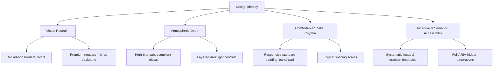

# Blur Effect Design
> **Version 1.0**  
---

## 1. Core Philosophy & Design Identity

The interface design relies on a **premium, restrained, and atmospheric aesthetic**. It rejects generic, loud, or raw bootstrap-like patterns in favor of structured depth, controlled light theory, and precise typographic contrast.

Every page, shell, component, and interaction state must maintain the following core identity pillars:



### 1.1 Visual Restraint & Premium Neutrals
* **No ad-hoc styles:** Always use existing utility classes (`panel`, `panel-pad`, `button-primary`, and the custom `ink` scale). Avoid creating one-off borders, backgrounds, or drop-shadows.
* **Calm Accentuation:** Accent colors (such as Emerald for success/auth/domains and Indigo for secondary decoration) must be used sparingly. The interface's premium feel comes from high-contrast neutrals rather than overwhelming colorful elements.

### 1.2 Atmospheric Depth (Ambient Light & Glow)
* **Glow Layering:** Use absolute-positioned circles with a high blur (`blur-3xl`) and low opacity (`opacity-10`) to simulate premium backlighting.
* **Dark Mode Restraint:** In dark mode, hide standard colorful light-mode glows via `dark:hidden` to ensure deep contrast and rich black/gray backgrounds.

### 1.3 Comfortable Spatial Rhythm
* **Responsive Pad:** A standardized, comfortable responsive padding system should scale from mobile to desktop layouts gracefully.
* **Vertical Breathing Room:** Align layouts with clear vertical hierarchies using `space-y-6` for component groupings and `space-y-3` for copy blocks.

---

## 2. Design Tokens & Core Utilities

To implement this design system consistently, the following classes and properties must be configured in your Tailwind/CSS setup.

### 2.1 The Ink Color Palette (Neutrals)
The `ink` palette represents custom neutral colors tailored for high-end digital interfaces. 

| Tailwind Class | Color Description (Light Mode) | Color Description (Dark Mode) | Purpose |
| :--- | :--- | :--- | :--- |
| `bg-ink-50` / `text-ink-50` | Slate Gray / Silver Tint | Soft Cream White (Text) | High-contrast dark backgrounds / Soft dark mode text |
| `text-ink-400` | Muted Gray-Slate | Slate-Silver Tint | Secondary dark-mode descriptions |
| `text-ink-500` | Classic Muted Gray | Muted Charcoal Tint | Secondary light-mode copy & labels |
| `text-ink-950` / `bg-ink-950` | Deep Charcoal/Midnight (Text) | Crisp Premium White | Light-mode titles / Dark-mode icon badge backgrounds |

### 2.2 Semantic Accent Palette

```
  🟢 Emerald (Success / Auth)       🔵 Indigo (Decor / Secondary)       🔴 Red (Subtle Warning / Error)
  ---------------------------       -----------------------------       -------------------------------
  bg-emerald-500/10                 bg-indigo-500/10                    bg-red-50 / dark:bg-red-950/20
  text-emerald-600                  text-indigo-600                     text-red-600 / dark:text-red-400
  border-emerald-100                border-indigo-100                   border-red-100 / dark:border-red-900/50
```

---

## 3. Structural Wireframing & Layout Shells

All premium sections and pages must adhere to the structured nesting hierarchy to maintain fluid layouts, accurate absolute overlays, and proper z-indexing.

### 3.1 The Page Wrapper
Use a responsive container centered in the viewport with standard padding and constraints:
```html
<main class="min-h-screen bg-ink-50/50 dark:bg-ink-950 text-ink-950 dark:text-ink-50 transition-colors duration-300 py-12 px-4 sm:px-6 lg:px-8">
  <div class="max-w-7xl mx-auto space-y-12">
    <!-- Page Content goes here -->
  </div>
</main>
```

### 3.2 Canonical Card Panel (`panel` + `panel-pad`)
This is the fundamental visual container for empty states, login portals, dashboard widgets, and user prompts:

```html
<section class="panel panel-pad relative overflow-hidden flex flex-col items-center justify-center text-center py-12 px-6 sm:px-12 max-w-2xl mx-auto my-8">
  <!-- 1. Ambient Glow Layers (Aria-hidden & Click-through-safe) -->
  <div class="pointer-events-none absolute -left-16 -top-16 h-64 w-64 rounded-full bg-emerald-500/10 blur-3xl dark:hidden" aria-hidden="true"></div>
  <div class="pointer-events-none absolute -right-16 -bottom-16 h-64 w-64 rounded-full bg-indigo-500/10 blur-3xl dark:hidden" aria-hidden="true"></div>

  <!-- 2. Content Container (Raised Z-Index) -->
  <div class="relative z-10 flex flex-col items-center space-y-6 max-w-md">
    
    <!-- A. Icon Badge (2xl Radius, High Contrast Accent) -->
    <span class="flex h-16 w-16 items-center justify-center rounded-2xl bg-ink-950 text-white dark:bg-ink-50 dark:text-ink-950 shadow-lg" aria-hidden="true">
      <!-- Domain Relevant SVG Icon -->
    </span>

    <!-- B. Typographic Block -->
    <div class="space-y-3">
      <h3 class="text-2xl font-bold tracking-tight text-ink-950 dark:text-ink-50 sm:text-3xl">Card Heading</h3>
      <p class="text-sm text-ink-500 dark:text-ink-400 leading-relaxed">
        Supporting copy text should be clear, action-driven, and contain at most one 
        <strong class="font-semibold text-emerald-600 dark:text-emerald-400">highlighted condition</strong>.
      </p>
    </div>

    <!-- C. Action Block -->
    <div class="flex flex-col items-center gap-3 w-full">
      <button type="button" class="button-primary group inline-flex items-center gap-2.5 px-8 py-3.5">
        <span>Primary Action</span>
      </button>
    </div>

  </div>
</section>
```

---

## 4. Component Design Specifications

### 4.1 Typography Standards
Never use standard raw headers or paragraph sizes. Adhere to the following structured classes:

* **Page Title (Hero Headings):**
  `text-3xl sm:text-4xl font-extrabold tracking-tight text-ink-950 dark:text-ink-50`
* **Card/Widget Headings:**
  `text-2xl sm:text-3xl font-bold tracking-tight text-ink-950 dark:text-ink-50`
* **Sub-section/Field Headings:**
  `text-lg font-semibold tracking-tight text-ink-950 dark:text-ink-50`
* **Primary Body Copy:**
  `text-sm leading-relaxed text-ink-500 dark:text-ink-400`
* **Muted Captions & Details:**
  `text-xs text-ink-400 dark:text-ink-500`

### 4.2 Premium Button Archetypes
Buttons must feature a subtle micro-interaction (scale and transition) to feel premium and tactile.

#### Primary Action Button (`button-primary`)
* **Standard:** `button-primary px-6 py-2.5 text-sm font-medium rounded-xl transition-all duration-200 active:scale-95 shadow-md shadow-emerald-500/5`
* **With Icon / Spinner:** `button-primary group inline-flex items-center gap-2.5 px-8 py-3.5 text-sm font-medium rounded-xl transition-all duration-200 active:scale-95`

#### Secondary / Outline Button (`button-secondary`)
Used for canceling, back actions, or auxiliary options to avoid visual competition with the primary button:
* **Classes:** `border border-ink-200 dark:border-ink-800 bg-white dark:bg-ink-900 text-ink-700 dark:text-ink-300 hover:bg-ink-50 dark:hover:bg-ink-850 px-6 py-2.5 text-sm font-medium rounded-xl transition-all duration-200 active:scale-95`

#### Interactive Button States
* **Disabled:** Bind `:disabled` or `disabled` attribute. The style shifts to `opacity-50 pointer-events-none cursor-not-allowed filter grayscale-[30%]`.
* **Loading State:** The icon or badge content is replaced by an active SVG spinner.

```vue
<!-- Loading Spinner Code Spec -->
<svg class="animate-spin h-4 w-4 text-current" fill="none" viewBox="0 0 24 24" xmlns="http://www.w3.org/2000/svg">
  <circle class="opacity-25" cx="12" cy="12" r="10" stroke="currentColor" stroke-width="4"></circle>
  <path class="opacity-75" fill="currentColor" d="M4 12a8 8 0 018-8V0C5.373 0 0 5.373 0 12h4zm2 5.291A7.962 7.962 0 014 12H0c0 3.042 1.135 5.824 3 7.938l3-2.647z"></path>
</svg>
```

### 4.3 Form Inputs & Fields
Inputs should fit seamlessly inside panels, utilizing rounded corners and clean borders:

* **Field Wrapper:** `flex flex-col gap-1.5 w-full text-left`
* **Field Label:** `text-xs font-semibold uppercase tracking-wider text-ink-500 dark:text-ink-400`
* **Input Box:** `w-full px-4 py-3 rounded-xl border border-ink-200 dark:border-ink-800 bg-white dark:bg-ink-900 text-ink-950 dark:text-ink-50 text-sm placeholder-ink-400 dark:placeholder-ink-600 focus:outline-none focus:ring-2 focus:ring-emerald-500/20 focus:border-emerald-500 transition-all`

### 4.4 Status Alerts & Error Banners
Avoid standard bright red alert banners. Instead, render elegant, low-opacity warning boxes:

```html
<!-- Premium Inline Error Alert Spec -->
<div class="text-xs text-red-600 dark:text-red-400 font-medium bg-red-50 dark:bg-red-950/20 px-3.5 py-2 rounded-lg border border-red-100 dark:border-red-900/50 max-w-sm flex items-start gap-2 text-left" role="alert">
  <svg class="h-3.5 w-3.5 shrink-0 mt-0.5" fill="none" viewBox="0 0 24 24" stroke-width="2.5" stroke="currentColor">
    <path stroke-linecap="round" stroke-linejoin="round" d="M12 9v3.75m9-.75a9 9 0 11-18 0 9 9 0 0118 0zm-9 3.75h.008v.008H12v-.008z" />
  </svg>
  <span>Error message explanation.</span>
</div>
```

---

## 5. Interaction States & Dynamic UI

A digital product is defined by how it responds to user actions. Every interactive block must adhere to the standard micro-state pipeline.

```
[Normal State] ---> (Hover: scale/translate + transition) ---> [Active/Click: scale-95]
                                                                     |
                                                                     v
                                                            [Loading: spin + disabled]
```

* **Hover Micro-Animations:** Buttons, link cards, and form inputs should transition smoothly. Use classes like `transition-all duration-300 ease-out hover:-translate-y-0.5 hover:shadow-lg`.
* **Focus States:** Every actionable element must have a clear focus ring using offset systems: `focus-visible:ring-2 focus-visible:ring-emerald-500 focus-visible:ring-offset-2 dark:focus-visible:ring-offset-ink-950 outline-none`.
* **Tab-Index:** Interactive overlay cards must declare `tabindex="0"` if clicked as a full element, or delegate keyup handlers to nested native buttons.

---

## 6. Accessibility & Inclusivity Guidelines (A11y)

1. **Aria-Hidden Roles:** Always add `aria-hidden="true"` to ambient backdrop glows (`-left-16`, etc.) and non-semantic SVGs. This prevents screen-reader confusion.
2. **Action Semantic Tags:** Ensure links that navigate have real `<a>` tags with `href`, and structural controls that trigger javascript behaviors are strict `<button type="button">` tags. Do not assign click handlers to arbitrary `<div>` elements without role definitions.
3. **Muted Contrast Ratios:** Ensure text scales meet standard visual compliance. The `text-ink-500` on `bg-white` and `text-ink-400` on `dark:bg-ink-950` both satisfy AA requirements. Avoid using lighter variations for semantic copy.

---

## 7. Responsive Breakpoint Rules

To maintain high visual quality on displays from 320px mobile up to 4K desktop screens:

* **Padding Scale:**
  * Mobile: `py-10 px-6`
  * Tablet (`sm:`): `py-12 px-10`
  * Desktop (`lg:`): `py-16 px-12`
* **Max Width Constraints:**
  * Widget Panels: `max-w-md`
  * Card Standard Sections: `max-w-2xl`
  * Full Page Layout Standard: `max-w-7xl`

---

## 8. Development Checklist

Before deploying any new screen or interface update to the repository, ensure your design complies with this core checklist:

- [ ] Outer container uses existing `panel` and `panel-pad` structure.
- [ ] No ad-hoc shadows, borders, or colors are used; styles are mapped entirely to existing utility classes.
- [ ] Atmospheric ambient glows are marked `aria-hidden="true"` and are hidden in dark mode (`dark:hidden`).
- [ ] Sub-headings and body copies are set to standard sizes (`text-2xl` for headings, `text-sm` for copy).
- [ ] Buttons use `button-primary` or outline variations with standardized active micro-animations (`active:scale-95 transition-all`).
- [ ] Errors, loading, and disabled states are visually light, using soft borders and low opacity instead of high-contrast solids.
- [ ] Focus states are set explicitly and satisfy accessibility keyboard navigation constraints.
